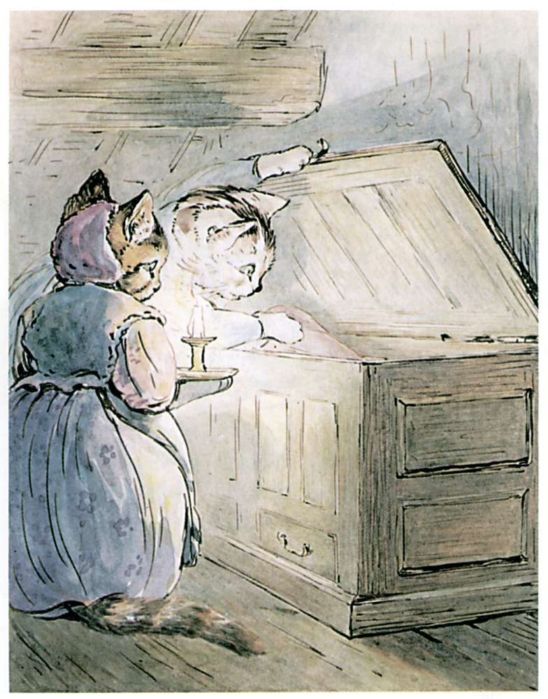

###Ribby and Tabitha set to work to search the house thoroughly again. They poked under the beds with Ribby's umbrella, and they rummaged in cupboards. They even fetched a candle, and looked inside a clothes chest in one of the attics. They could not find anything, but once they heard a door bang and somebody scuttered downstairs.

###"Yes, it is infested with rats," said Tabitha tearfully. "I caught seven young ones out of one hole in the back kitchen, and we had them for dinner last Saturday. And once I saw the old father rat—an enormous old rat, Cousin Ribby. I was just going to jump upon him, when he showed his yellow teeth at me and whisked down the hole."

###"The rats get upon my nerves, Cousin Ribby," said Tabitha.
