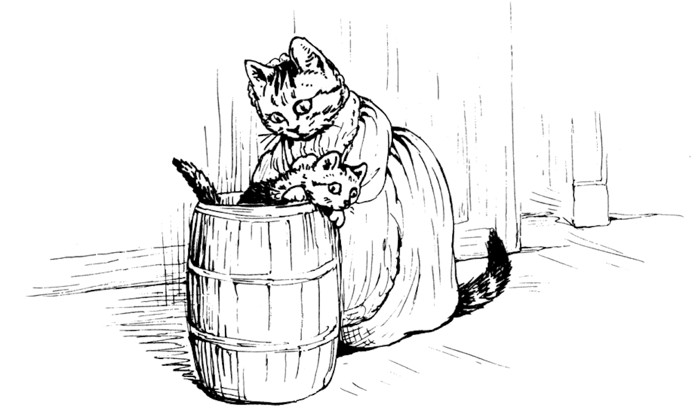

###They returned to the kitchen. "Here's one of your kittens at least," said Ribby, dragging Moppet out of the flour barrel.

###They shook the flour off her and set her down on the kitchen floor. She seemed to be in a terrible fright.

###"Oh! Mother, Mother," said Moppet, "there's been an old woman rat in the kitchen, and she's stolen some of the dough!"

###The two cats ran to look at the dough pan. Sure enough there were marks of little scratching fingers, and a lump of dough was gone!

###"Which way did she go, Moppet?"

###But Moppet had been too much frightened to peep out of the barrel again.

###Ribby and Tabitha took her with them to keep her safely in sight, while they went on with their search.

###
