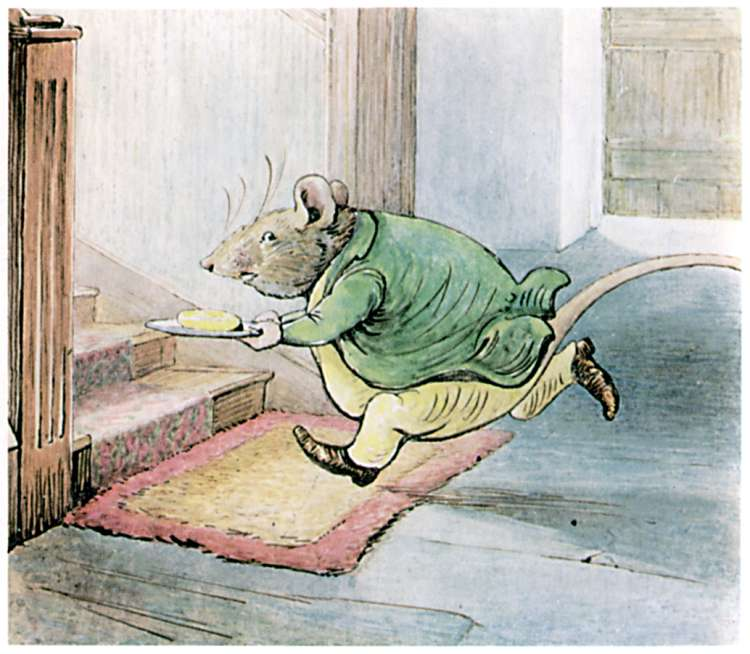

"Oh! Mother, Mother, there has been an old man rat in the dairy—a dreadful 'normous big rat, mother; and he's stolen a pat of butter and the rolling-pin."

Ribby and Tabitha looked at one another.

"A rolling-pin and butter! Oh, my poor son Thomas!" exclaimed Tabitha, wringing her paws.

"A rolling-pin?" said Ribby. "Did we not hear a roly-poly noise in the attic when we were looking into that chest?"

Ribby and Tabitha rushed upstairs again. Sure enough the roly-poly noise was still going on quite distinctly under the attic floor.

