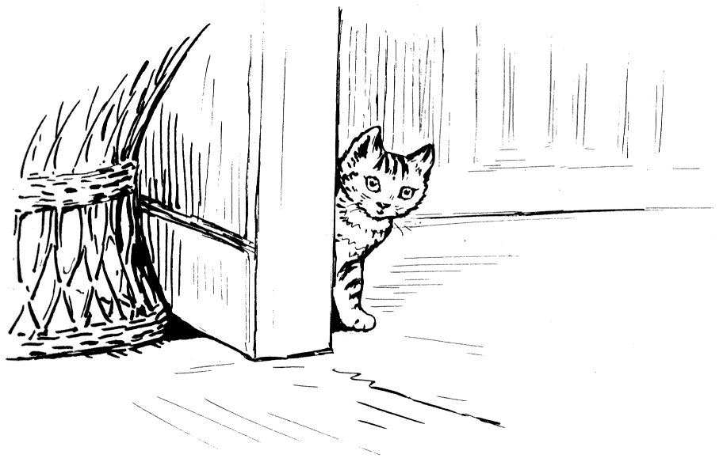

Now this is what had been happening to Tom Kitten, and it shows how very unwise it is to go up a chimney in a very old house, where a person does not know his way, and where there are enormous rats.

Tom Kitten did not want to be shut up in a cupboard. When he saw that his mother was going to bake, he determined to hide.

He looked about for a nice convenient place, and he fixed upon the chimney.
