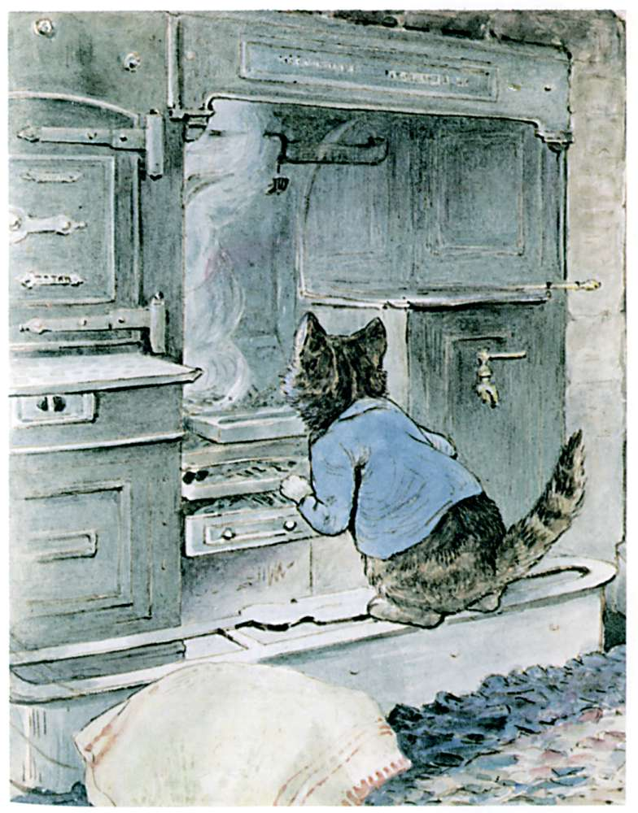

The fire had only just been lighted, and it was not hot; but there was a white choky smoke from the green sticks. Tom Kitten got upon the fender and looked up. It was a big old-fashioned fire-place.

The chimney itself was wide enough inside for a man to stand up and walk about. So there was plenty of room for a little Tom Kitten.

