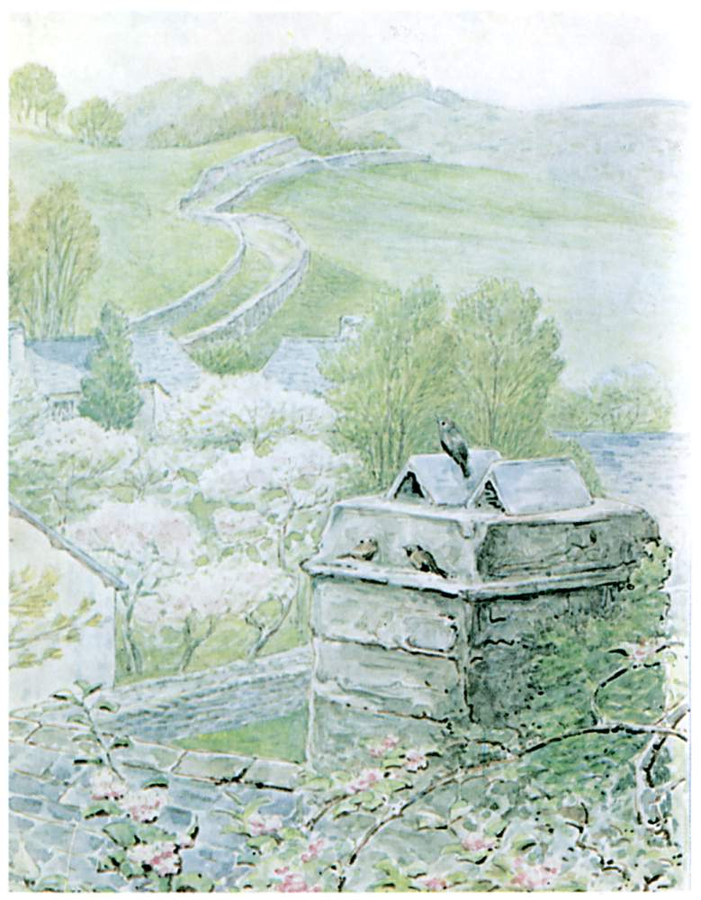

Tom Kitten coughed and choked with the smoke; and he could hear the sticks beginning to crackle and burn in the fire-place down below. He made up his mind to climb right to the top, and get out on the slates, and try to catch sparrows.

"I cannot go back. If I slipped I might fall in the fire and singe my beautiful tail and my little blue jacket."