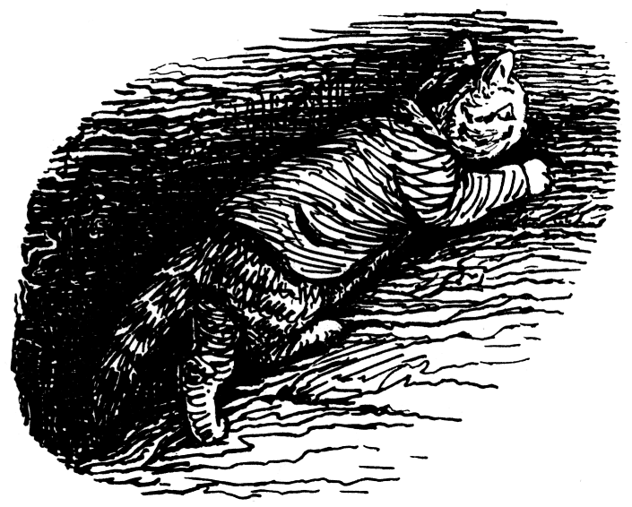

The chimney was a very big old-fashioned one. It was built in the days when people burnt logs of wood upon the hearth.

The chimney stack stood up above the roof like a little stone tower, and the daylight shone down from the top, under the slanting slates that kept out the rain.

Tom Kitten was getting very frightened! He climbed up, and up, and up.