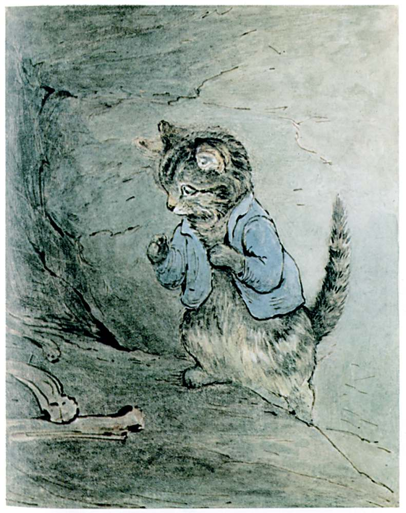

He scrambled up and up; but before he reached the chimney top he came to a place where somebody had loosened a stone in the wall. There were some mutton bones lying about—

"This seems funny," said Tom Kitten. "Who has been gnawing bones up here in the chimney? I wish I had never come! And what a funny smell? It is something like mouse; only dreadfully strong. It makes me sneeze," said Tom Kitten.

