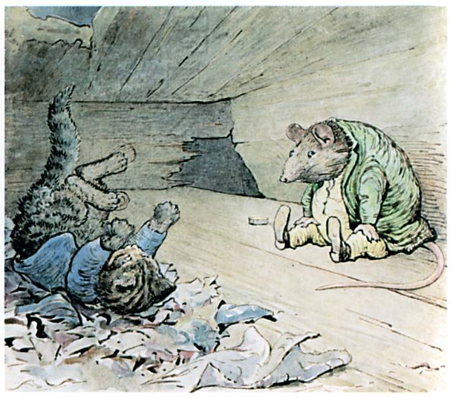

All at once he fell head over heels in the dark, down a hole, and landed on a heap of very dirty rags.

When Tom Kitten picked himself up and looked about him—he found himself in a place that he had never seen before, although he had lived all his life in the house.

It was a very small stuffy fusty room, with boards, and rafters, and cobwebs, and lath and plaster.

Opposite to him—as far away as he could sit—was an enormous rat.

"What do you mean by tumbling into my bed all covered with smuts?" said the rat, chattering his teeth.