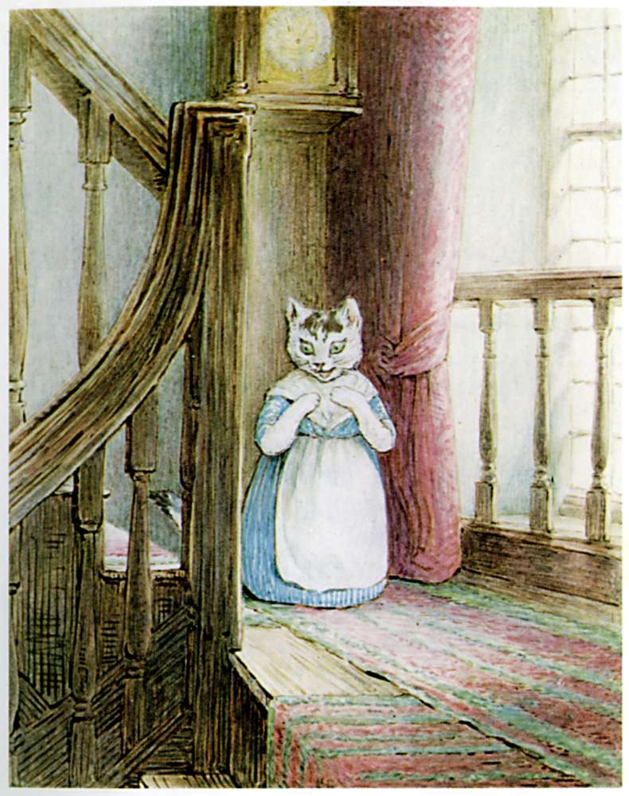

###Mrs. Tabitha went up and down all over the house, mewing for Tom Kitten. She looked in the pantry under the staircase, and she searched the best spare bedroom that was all covered up with dust sheets. She went right upstairs and looked into the attics, but she could not find him anywhere.

###It was an old, old house, full of cupboards and passages. Some of the walls were four feet thick, and there used to be queer noises inside them, as if there might be a little secret staircase. Certainly there were odd little jagged doorways in the wainscot, and things disappeared at night—especially cheese and bacon.

###Mrs. Tabitha became more and more distracted, and mewed dreadfully.

