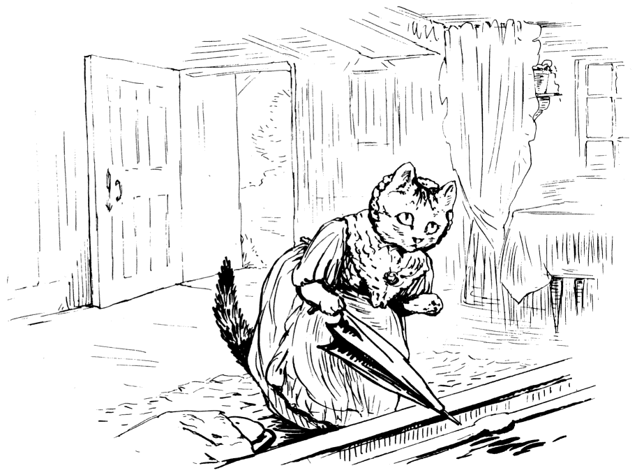

###Mrs. Tabitha came downstairs mewing dreadfully—"Come in, Cousin Ribby, come in, and sit ye down! I'm in sad trouble, Cousin Ribby," said Tabitha, shedding tears. "I've lost my dear son Thomas; I'm afraid the rats have got him." She wiped her eyes with her apron.

###"He's a bad kitten, Cousin Tabitha; he made a cat's cradle of my best bonnet last time I came to tea. Where have you looked for him?"

###"All over the house! The rats are too many for me. What a thing it is to have an unruly family!" said Mrs. Tabitha Twitchit.

###"I'm not afraid of rats; I will help you to find him; and whip him too! What is all that soot in the fender?"